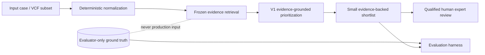

# GenomeTriage

**Evidence-grounded genomic variant prioritization for expert review.**

GenomeTriage helps genomic researchers and qualified reviewers turn a noisy set of
candidate variants into a smaller, traceable shortlist. Deterministic normalization
and frozen evidence retrieval precede one evidence-constrained V1 model call; every
output stops at human review.

### Headline result: frozen V0 → retained V1

- **77.8% fewer false positives** — 9 → 2
- **30.4% lower review burden** — 23 → 16
- **100% Recall@3 preserved** — 1.000 → 1.000
- **60.9% → 87.5% shortlist precision**

The complete V1 evidence-grounded pipeline produced the measured improvement. The
deterministic V0-top3 control was prediction-identical to V0, so shortlist
truncation explained `0/7` false-positive reductions. Retrieval alone was not
isolated as the cause.

**For research/expert review. Not a medical diagnosis.** GenomeTriage makes no
autonomous diagnosis, treatment recommendation, or clinical decision. Phase 1/2
fixtures and the conflict track are synthetic. The separate public track contains
appropriately public aggregate ClinVar records—never private patient data.



## Judge Mode quickstart

Windows PowerShell, Python 3.10+:

```powershell
python -m venv .venv
.\.venv\Scripts\python.exe -m pip install -e ".[dev]"
.\.venv\Scripts\python.exe -m genometriage.app.run
```

Open `http://127.0.0.1:8765`. The demo is fully offline and prominently labels
retained output as **Recorded benchmark execution / deterministic replay**.


The application includes built-in V1 cases, normalization, exact retrieved
evidence, provenance, ranked shortlists, uncertainty, same-case V0/V1 comparison,
an evaluation dashboard, the Improvement Journey, input normalization, and exact
reproduction commands. Evaluator ground truth is not loaded in product mode.

## Phase 3 result

Phase 3 tested a preregistered deterministic conflict-arbitration stage (V3) on the
legacy regression benchmark, a new 13-case conflict-heavy synthetic benchmark, and
a separately frozen 10-case public ClinVar benchmark.

| Track | System | Recall@3 | False positives | Review burden | Shortlist precision |
|---|---|---:|---:|---:|---:|
| `benchmark_v1` regression | V1 | 1.000 | 2 | 16 | 0.875000 |
| `benchmark_v1` regression | V3 | 0.909 | 2 | 14 | 0.857143 |
| `benchmark_conflict_v1` | V1 | 1.000 | 4 | 17 | 0.764706 |
| `benchmark_conflict_v1` | V3 | 1.000 | 0 | 13 | 1.000000 |
| `benchmark_public_v1` | V1 | 1.000 | 1 | 11 | 0.909091 |
| `benchmark_public_v1` | V3 | 1.000 | 0 | 10 | 1.000000 |

V3 made zero additional model calls and added less than one millisecond of retained
mean deterministic time per case. It earned its small complexity on the new
dimensioned conflict/public tracks, but it is **not a global replacement for V1**:
it removed true positives in legacy case `GT-004` and failed the frozen Recall@3
constraint. The decision is to revise the evidence-strength/schema calibration,
not to tune the frozen V3 policy after seeing results.

See [`results/phase3/COMPARISON.md`](results/phase3/COMPARISON.md),
[`docs/PHASE3.md`](docs/PHASE3.md), and
[`docs/PUBLIC_BENCHMARK.md`](docs/PUBLIC_BENCHMARK.md).

## Phase 2 result

Phase 1's Gemini V0 artifacts are frozen and hash-guarded. Phase 2 tested whether
local evidence retrieval and independent claim verification could preserve V0
Recall@3 while reducing expert-review burden.

| Metric | V0 | V0-top3 | V1 evidence grounded | V2 verified |
|---|---:|---:|---:|---:|
| Recall@3 | 1.000 | 1.000 | 1.000 | 1.000 |
| False positives | 9 | 9 | 2 | 2 |
| Review burden | 23 | 23 | 16 | 16 |
| Review burden at full recall | 14 | 14 | 14 | 14 |
| Shortlist precision | 0.608696 | 0.608696 | 0.875000 | 0.875000 |
| Mean runtime (seconds/case) | 2.321 | 2.321 | 2.522 | 5.601 |
| Total tokens | 23,275 | 23,275 | 42,826 | 69,517 |

V0 already returned at most three candidates per case, so the deterministic top-3
control is prediction-identical to V0: truncation explains none of the seven
false-positive reductions. V1 retains a measurable advantage after that control,
but it is attributed to the complete V1 pipeline comparison rather than retrieval
alone because model, prompt, and selection behavior also changed. V2 preserved
recall and semantic claim support, but did not improve the shortlist beyond V1. See
[`results/phase2-comparison.md`](results/phase2-comparison.md) and the machine-readable
failure analysis in `results/phase2-failure-analysis.json`.

Precision@5 remains 0.233 for all systems because the historical metric uses a fixed
denominator of five even when a system returns fewer than five variants. Review
burden and false-positive count directly capture the reduction.

## Systems

- **V0, frozen:** one general-purpose Gemini call receives the model-visible case.
- **V1:** deterministic allele normalization, exact retrieval from the frozen local
  evidence snapshot, then one evidence-constrained prioritization call. It returns
  at most three candidates.
- **V2:** reuses V1 output and makes one independent verification call for each case
  with claims. It cannot introduce or reorder candidates. Deterministic report
  assembly prevents contradicted or insufficient claims from appearing as
  established facts.
- **V3:** reuses V1 output and applies the frozen deterministic
  `conflict_arbitration_v1` policy. It cannot add/promote candidates and makes no
  additional model call. Candidate audit states are `retain`, `deprioritize`,
  `insufficient_evidence`, or `conflicting_evidence`.

Ground truth is loaded only by evaluation after raw predictions exist. V1/V2/V3
never receive the evaluator-only files.

## Final product decision

V1 is the default production/demo workflow. It preserved the frozen recall
constraint, substantially reduced review burden, and generalized strongly to the
held-out conflict/public tracks. V2 is not retained because it added a verifier,
runtime, and tokens without shortlist improvement. V3 remains experimental: it
removed five false positives across conflict/public tracks but reduced legacy
Recall@3 from `1.000000` to `0.909091`.

The app uses Python's standard-library HTTP server plus local HTML/CSS/JavaScript;
it adds no web framework, authentication, cloud service, or runtime dependency.
Built-in “runs” replay actual retained V1 artifacts. Uploaded supported JSON/VCF is
normalized deterministically but never assigned a fabricated offline ranking.

Offline app commands:

```powershell
.\.venv\Scripts\python.exe -m genometriage.app.run --smoke-test
.\.venv\Scripts\python.exe -m genometriage.app.run --host 127.0.0.1 --port 8765
```

The first command validates the app and exits. The second starts Judge Mode.

## Clean installation

Python 3.10 or newer is required. Runtime, build, and test dependencies are pinned
in `pyproject.toml`.

Windows PowerShell:

```powershell
cd C:\path\to\genometriage
python -m venv .venv
.\.venv\Scripts\python.exe -m pip install --upgrade pip==26.1.1
.\.venv\Scripts\python.exe -m pip install -e ".[dev]"
```

macOS/Linux:

```bash
cd /path/to/genometriage
python3 -m venv .venv
./.venv/bin/python -m pip install --upgrade pip==26.1.1
./.venv/bin/python -m pip install -e '.[dev]'
```

## Validate and test

The Phase 4 submission was verified on Python `3.14.5`. The package supports
Python 3.10+; important versions are pinned in `pyproject.toml` (`pydantic
1.10.26`, `python-dotenv 1.2.3`, `pytest 9.0.3`, and `pytest-cov 7.0.0`).

Windows PowerShell:

```powershell
.\.venv\Scripts\python.exe -m genometriage.benchmark.validate
.\.venv\Scripts\python.exe -m genometriage.benchmark.validate --cases data\cases\benchmark_conflict_v1.jsonl --ground-truth data\ground_truth\benchmark_conflict_v1_ground_truth.jsonl
.\.venv\Scripts\python.exe -m genometriage.benchmark.validate --cases data\cases\benchmark_public_v1.jsonl --ground-truth data\ground_truth\benchmark_public_v1_ground_truth.jsonl
.\.venv\Scripts\python.exe -m genometriage.evidence.build
.\.venv\Scripts\python.exe scripts\validate_phase3_freezes.py
.\.venv\Scripts\python.exe scripts\build_trajectories.py
.\.venv\Scripts\python.exe scripts\validate_phase4.py
.\.venv\Scripts\python.exe -m genometriage.app.run --smoke-test
.\.venv\Scripts\python.exe -m pytest -q
.\.venv\Scripts\python.exe -m pip check
```

macOS/Linux:

```bash
./.venv/bin/python -m genometriage.benchmark.validate
./.venv/bin/python -m genometriage.benchmark.validate --cases data/cases/benchmark_conflict_v1.jsonl --ground-truth data/ground_truth/benchmark_conflict_v1_ground_truth.jsonl
./.venv/bin/python -m genometriage.benchmark.validate --cases data/cases/benchmark_public_v1.jsonl --ground-truth data/ground_truth/benchmark_public_v1_ground_truth.jsonl
./.venv/bin/python -m genometriage.evidence.build
./.venv/bin/python scripts/validate_phase3_freezes.py
./.venv/bin/python scripts/build_trajectories.py
./.venv/bin/python scripts/validate_phase4.py
./.venv/bin/python -m genometriage.app.run --smoke-test
./.venv/bin/python -m pytest -q
./.venv/bin/python -m pip check
```

The evidence build must report 53 records. Its hash is pinned in
`data/evidence/evidence_v1_manifest.json`.

## Configure Gemini for a new live run

Copy `.env.example` to the ignored `.env` and add a Gemini API key. Never place a
key in source, shell history, predictions, results, or chat.

Windows PowerShell:

```powershell
if (-not (Test-Path .env)) { Copy-Item .env.example .env }
# Edit .env and set GEMINI_API_KEY; do not paste it into this command history.
```

macOS/Linux:

```bash
test -f .env || cp .env.example .env
# Edit .env and set GEMINI_API_KEY; do not paste it into shell history.
```

The retained runs used the standard Gemini free tier and explicit zero rates. Set
both cost variables to `0` only when AI Studio confirms that the key's project is
on that tier. Otherwise supply the applicable current prices or leave them blank,
which produces `null` rather than an invented cost.

## Optional new live V1/V2 run

These commands are not required for the demo or retained-result reproduction.
They call Gemini and write only beneath ignored `predictions/live` and
`results/live` directories, protecting the historical artifacts. A new run can
differ from the frozen benchmark execution because it uses an external service.

Windows PowerShell:

```powershell
New-Item -ItemType Directory -Force predictions\live, results\live | Out-Null
.\.venv\Scripts\python.exe -m genometriage.phase2.run --system v1 --provider gemini --model gemini-3.5-flash-lite --output predictions\live\evidence-grounded-v1.json --fail-fast --resume
.\.venv\Scripts\python.exe -m eval.run --system v1 --predictions predictions\live\evidence-grounded-v1.json --output results\live\evidence-grounded-v1.json

.\.venv\Scripts\python.exe -m genometriage.phase2.run --system v2 --provider gemini --model gemini-3.5-flash --v1-predictions predictions\live\evidence-grounded-v1.json --output predictions\live\verified-v2.json --fail-fast --resume
.\.venv\Scripts\python.exe -m eval.run --system v2 --predictions predictions\live\verified-v2.json --output results\live\verified-v2.json
```

macOS/Linux:

```bash
mkdir -p predictions/live results/live
./.venv/bin/python -m genometriage.phase2.run --system v1 --provider gemini --model gemini-3.5-flash-lite --output predictions/live/evidence-grounded-v1.json --fail-fast --resume
./.venv/bin/python -m eval.run --system v1 --predictions predictions/live/evidence-grounded-v1.json --output results/live/evidence-grounded-v1.json

./.venv/bin/python -m genometriage.phase2.run --system v2 --provider gemini --model gemini-3.5-flash --v1-predictions predictions/live/evidence-grounded-v1.json --output predictions/live/verified-v2.json --fail-fast --resume
./.venv/bin/python -m eval.run --system v2 --predictions predictions/live/verified-v2.json --output results/live/verified-v2.json
```

Each live run is atomically checkpointed after every completed case. `--resume`
accepts a checkpoint only when benchmark, prompt, model, evidence, and execution
settings match exactly. V2 reads retained V1 predictions and does not rerun V1.

## Reproduce retained results without API calls

These commands read the frozen predictions and write regenerated evaluation files
only beneath ignored `results/replay` and `predictions/replay` directories. They do
not call Gemini and do not modify the retained result files.

Windows PowerShell:

```powershell
New-Item -ItemType Directory -Force predictions\replay, results\replay, results\replay\phase3 | Out-Null
.\.venv\Scripts\python.exe -m pytest -q
.\.venv\Scripts\python.exe -m eval.run --system baseline --predictions predictions\baseline-gemini.json --output results\replay\v0.json
.\.venv\Scripts\python.exe -m genometriage.controls.v0_top3 --source predictions\baseline-gemini.json --output predictions\replay\v0-top3-control.json
.\.venv\Scripts\python.exe -m eval.run --system v0-top3-control --predictions predictions\replay\v0-top3-control.json --output results\replay\v0-top3.json
.\.venv\Scripts\python.exe -m eval.run --system v1 --predictions predictions\evidence-grounded-v1.json --output results\replay\v1.json
.\.venv\Scripts\python.exe -m eval.run --system v2 --predictions predictions\verified-v2.json --output results\replay\v2.json
.\.venv\Scripts\python.exe -m genometriage.reporting.comparison --output-json results\replay\phase2-comparison.json --output-markdown results\replay\phase2-comparison.md --failure-analysis results\replay\phase2-failures.json
.\.venv\Scripts\python.exe -m genometriage.reporting.phase3 --output-json results\replay\phase3\comparison.json --output-markdown results\replay\phase3\COMPARISON.md --failure-analysis results\replay\phase3\failures.jsonl
```

The test suite verifies every Phase 1 frozen-artifact hash from
`docs/PHASE1_FREEZE.json`. Evaluation replay is deterministic except for result
generation timestamps. Expected outputs are `results/replay/v0.json`,
`v0-top3.json`, `v1.json`, `v2.json`, the Phase 2 comparison/failure files, and
the three `results/replay/phase3` report files.

## Reproduce Phase 3 without API calls

The following commands consume retained V1 predictions, run only deterministic V3
arbitration, and evaluate into a separate `results/replay` directory. They do not
call Gemini or overwrite retained Phase 1/2 prediction/result artifacts.

Windows PowerShell:

```powershell
.\.venv\Scripts\python.exe scripts\validate_phase3_freezes.py
New-Item -ItemType Directory -Force predictions\replay, results\replay | Out-Null

.\.venv\Scripts\python.exe -m genometriage.phase3.run --v1-predictions predictions\evidence-grounded-v1.json --output predictions\replay\benchmark_v1-v3.json
.\.venv\Scripts\python.exe -m genometriage.evaluation.run --system v1 --predictions predictions\evidence-grounded-v1.json --output results\replay\benchmark_v1-v1.json
.\.venv\Scripts\python.exe -m genometriage.evaluation.run --system v3 --predictions predictions\replay\benchmark_v1-v3.json --output results\replay\benchmark_v1-v3.json

.\.venv\Scripts\python.exe -m genometriage.phase3.run --cases data\cases\benchmark_conflict_v1.jsonl --evidence data\evidence\evidence_conflict_v1.jsonl --evidence-manifest data\evidence\evidence_conflict_v1_manifest.json --v1-predictions predictions\benchmark_conflict_v1-evidence-grounded-v1.json --output predictions\replay\conflict-v3.json
.\.venv\Scripts\python.exe -m genometriage.evaluation.run --system v1 --cases data\cases\benchmark_conflict_v1.jsonl --ground-truth data\ground_truth\benchmark_conflict_v1_ground_truth.jsonl --predictions predictions\benchmark_conflict_v1-evidence-grounded-v1.json --output results\replay\conflict-v1.json
.\.venv\Scripts\python.exe -m genometriage.evaluation.run --system v3 --cases data\cases\benchmark_conflict_v1.jsonl --ground-truth data\ground_truth\benchmark_conflict_v1_ground_truth.jsonl --predictions predictions\replay\conflict-v3.json --output results\replay\conflict-v3.json

.\.venv\Scripts\python.exe -m genometriage.phase3.run --cases data\cases\benchmark_public_v1.jsonl --evidence data\evidence\evidence_public_v1.jsonl --evidence-manifest data\evidence\evidence_public_v1_manifest.json --v1-predictions predictions\benchmark_public_v1-evidence-grounded-v1.json --output predictions\replay\public-v3.json
.\.venv\Scripts\python.exe -m genometriage.evaluation.run --system v1 --cases data\cases\benchmark_public_v1.jsonl --ground-truth data\ground_truth\benchmark_public_v1_ground_truth.jsonl --predictions predictions\benchmark_public_v1-evidence-grounded-v1.json --output results\replay\public-v1.json
.\.venv\Scripts\python.exe -m genometriage.evaluation.run --system v3 --cases data\cases\benchmark_public_v1.jsonl --ground-truth data\ground_truth\benchmark_public_v1_ground_truth.jsonl --predictions predictions\replay\public-v3.json --output results\replay\public-v3.json

.\.venv\Scripts\python.exe -m genometriage.reporting.phase3 --output-json results\replay\phase3\comparison.json --output-markdown results\replay\phase3\COMPARISON.md --failure-analysis results\replay\phase3\failures.jsonl
```

Use `/` paths and `./.venv/bin/python` for macOS/Linux. The retained V1 live runs
used the exact `gemini-3.5-flash-lite` model and the unchanged frozen V1 prompt;
V3 inherited their usage and provider timing and made no external call.

## Phase 1 baseline command

The original one-call baseline remains available but should not overwrite the
frozen retained files during comparison work:

```powershell
.\.venv\Scripts\python.exe -m genometriage.baseline.run --provider gemini --output predictions/baseline-new-run.json
.\.venv\Scripts\python.exe -m eval.run --system baseline --predictions predictions/baseline-new-run.json --output results/baseline-new-run.json
```

## Layout

```text
data/cases/                    model-visible synthetic and public cases
data/ground_truth/             evaluator-only labels
data/evidence/                 frozen provenance-rich evidence snapshot
data/public/clinvar/           pinned public ClinVar source pool and record manifest
data/manifests/                conflict/public benchmark freeze manifests
data/vcf/                      small supported-subset fixture
prompts/                       versioned V0, V1, and V2 prompts
src/genometriage/normalization/ deterministic VCF-subset normalization
src/genometriage/evidence/     snapshot build, validation, exact retrieval
src/genometriage/phase2/       V1 prioritizer and V2 verifier
src/genometriage/phase3/       frozen deterministic conflict arbitration
src/genometriage/app/          offline Judge Mode HTTP app and static interface
src/genometriage/controls/     deterministic no-model benchmark controls
src/genometriage/evaluation/   metrics and sealed-label evaluation
src/genometriage/reporting/    terminal, comparison, failure analysis
artifacts/trajectories/        five recorded, artifact-backed demo trajectories
tests/                         schema, separation, metrics, and pipeline tests
```

Design details are in [`docs/ARCHITECTURE.md`](docs/ARCHITECTURE.md),
[`docs/EVIDENCE_STORE.md`](docs/EVIDENCE_STORE.md),
[`docs/METRICS.md`](docs/METRICS.md), and
[`docs/IMPROVEMENT_CHANGELOG.md`](docs/IMPROVEMENT_CHANGELOG.md). Phase 3-specific
details are in [`docs/PHASE3.md`](docs/PHASE3.md) and
[`docs/PUBLIC_BENCHMARK.md`](docs/PUBLIC_BENCHMARK.md). Submission materials are
[`docs/FINAL_REPORT.md`](docs/FINAL_REPORT.md),
[`docs/VIDEO_SCRIPT.md`](docs/VIDEO_SCRIPT.md),
[`docs/SUBMISSION_CHECKLIST.md`](docs/SUBMISSION_CHECKLIST.md), and
[`docs/TRAJECTORIES.md`](docs/TRAJECTORIES.md).
