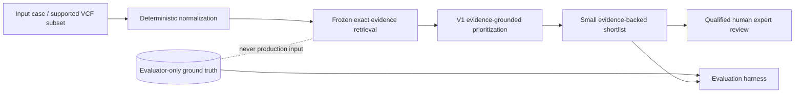

# GenomeTriage final technical report

**For research/expert review. Not a medical diagnosis.** GenomeTriage does not
make autonomous diagnoses, treatment recommendations, or clinical decisions.

This report distinguishes measured facts, benchmark-specific conclusions,
limitations, and future hypotheses. Historical predictions and evaluation results
are frozen and hash-guarded; Phase 4 adds a product and submission layer without
tuning V1 or rewriting research outcomes.

## 1. Problem

Genomic analysis can produce a large candidate set. The practical task is to
identify a small number of variants that deserve qualified human attention while
preserving the evidence and uncertainty needed to challenge the ranking.

GenomeTriage reduces a candidate set to a provenance-rich shortlist. It is a
research decision-support workflow, not a diagnostic system.

## 2. Intended user

The intended users are genomic researchers, variant scientists, and qualified
expert reviewers evaluating candidate variants. The workflow assumes domain
expertise at the final review checkpoint.

## 3. Current bottleneck

**Measured project finding:** the clearest remaining bottleneck is evidence-strength
and semantic-dimension calibration across evidence schemas. Structured conflict
evidence is easier to arbitrate deterministically than legacy evidence whose
semantic dimension defaults to `other`.

This is a project-specific result. It is not a universal claim about genomic
medicine or all agent systems.

## 4. Why the problem matters

High recall alone is insufficient when every unnecessary candidate consumes expert
review time. Conversely, reducing burden is unsafe if relevant variants disappear.
GenomeTriage therefore treats Recall@3 as a constraint and review burden/shortlist
precision as the optimization target.

## 5. Baseline

V0 is deliberately simple:

```text
model-visible case → one general-purpose Gemini call → ranked candidate list
```

It achieved Recall@3 `1.000` on the 12-case frozen benchmark, but returned nine
false positives and 23 total review candidates. Shortlist precision was `0.608696`.

## 6. Retained GenomeTriage architecture

V1 is the product/default workflow:



Deterministic syntax, normalization, evidence matching, hash validation, metrics,
and report assembly stay outside the model. V1 receives only model-visible context,
normalized candidates, and exact frozen evidence retrieved for those candidates.
Every material claim is associated with evidence identifiers.

## 7. Benchmark methodology

Three tracks are evaluated separately:

| Track | Composition | Purpose |
|---|---|---|
| `benchmark_v1` | 12 synthetic cases; one negative control | Frozen V0/V1 regression and same-case comparison |
| `benchmark_conflict_v1` | 13 held-out synthetic cases; two negative controls | Stress supporting molecular evidence versus stronger context/counterevidence |
| `benchmark_public_v1` | 10 cases/30 real public GRCh38 ClinVar SNVs | Test behavior on pinned public aggregate records |

Cases and evaluator-only labels are stored separately. The conflict benchmark was
frozen before the V3 policy. The public source pool, exact versioned VCV records,
transformation script, evidence, labels, and hashes were frozen before prediction.
Evaluation does not depend on mutable live services.

The public track follows NCBI's [ClinVar access and attribution guidance](https://www.ncbi.nlm.nih.gov/clinvar/docs/maintenance_use/)
and [review-status definitions](https://www.ncbi.nlm.nih.gov/clinvar/docs/review_status/).
It contains public aggregate records only—no private or identifiable genomic data.

## 8. Phase 1 result

**Measured:** V0 achieved Recall@1 `0.863636`, Recall@3/5 `1.000`, MRR
`1.000`, nine false positives, review burden 23, full-recall burden 14, and
shortlist precision `0.608696`.

This established a strong-recall but noisy baseline.

## 9. Phase 2 improvement

| Metric | V0 | V1 | Change |
|---|---:|---:|---:|
| Recall@3 | 1.000000 | 1.000000 | Preserved |
| False positives | 9 | 2 | −7 / −77.8% |
| Review burden | 23 | 16 | −7 / −30.4% |
| Full-recall burden | 14 | 14 | Preserved |
| Shortlist precision | 0.608696 | 0.875000 | +0.266304 / +26.6 points |
| Mean runtime/case | 2.321s | 2.522s | +0.201s |

**Benchmark-specific conclusion:** the complete V1 evidence-grounded pipeline
produced the measured improvement while preserving the recall constraint.

The experiment does not isolate retrieval as the sole cause: V1 also changes the
prompt, model version, and evidence-constrained selection behavior.

## 10. Deterministic top-3 control

V0 already returned no more than three candidates per case. Deterministically
truncating the retained V0 lists to three was prediction-identical to V0:

- false positives remained 9;
- review burden remained 23;
- shortlist precision remained `0.608696`;
- truncation explained `0/7` V0→V1 false-positive reductions.

## 11. Held-out conflict evaluation

| System | Recall@3 | False positives | Review burden | Shortlist precision |
|---|---:|---:|---:|---:|
| V1 default | 1.000000 | 4 | 17 | 0.764706 |
| V3 experimental | 1.000000 | 0 | 13 | 1.000000 |

V1 preserved strong recall on the unseen conflict-heavy track. V3's fixed
deterministic rules removed all four false positives there with essentially zero
additional local runtime and no model call.

## 12. Public ClinVar evaluation

On the frozen 10-case benchmark constructed from real public ClinVar records, V1
achieved Recall@3 `1.000`, shortlist precision `0.909091`, one false positive,
and review burden 11. V3 removed that false positive while preserving track recall.

**Limitation:** labels are a deterministic ClinVar-metadata proxy, not independently
adjudicated clinical truth. The relevant-record mix is five single-submitter, four
multiple-submitter/no-conflict, and one expert-panel record. These results are
research evaluation, not clinical validation or “100% clinical accuracy.”

## 13. Experiments not promoted

### V2 independent verification

V2 preserved V1 shortlist quality but did not remove additional candidates or
improve recall/precision. Mean runtime rose from `2.522s` to `5.601s`, and total
tokens rose from `42,826` to `69,517`. The experiment is preserved but not retained
in the product architecture.

### V3 deterministic conflict arbitration

V3 removed five false positives across conflict/public tracks and added no model
calls. However, regression Recall@3 fell from `1.000000` to `0.909091`; in
`GT-004`, its frozen minimum-support threshold removed both relevant V1 candidates.
V3 remains a transparent experiment, not the global default.

### Quantum

No quantum, quantum-inspired, simulator, or QUBO implementation was added. The
observed bottleneck is evidence calibration/schema transfer, not a demonstrated
combinatorial optimization limit.

## 14. Generalization limitations

- Benchmarks are small and cannot establish clinical validity.
- Synthetic tracks encode designed challenge patterns.
- Public proxy labels inherit ClinVar submission/review limitations.
- Strong public/conflict results do not prove universal generalization.
- V3's inverse gap—better on newer dimensioned tracks than legacy data—reveals
  schema-transfer sensitivity.
- Runtime includes provider latency; deterministic local processing is reported
  separately where available.

## 15. Safety and human review

Every product, prediction, report, trajectory, and API response displays:

> For research/expert review. Not a medical diagnosis.

The product does not expose evaluator ground truth in normal mode. Uploaded JSON or
VCF input is normalized locally but receives no invented offline ranking. New
rankings require an explicitly recorded live V1 run. Consequential interpretation
always remains with a qualified reviewer.

## 16. Reproducibility and model/API accounting

The retained benchmark runs used Gemini because the hackathon did not require a
paid model API. The exact model is retained in every prediction artifact.

| Artifact | Exact model | Calls | Input/output/total tokens | Mean runtime | Retained estimated cost |
|---|---|---:|---:|---:|---:|
| V0 | `gemini-3.1-flash-lite` | Historical aggregate unavailable; one-call architecture | 17,804 / 5,471 / 23,275 | 2.321s | $0 |
| V1 regression | `gemini-3.5-flash-lite` | 12 | 37,755 / 5,071 / 42,826 | 2.522s | $0 |
| V2 | `gemini-3.5-flash-lite+gemini-3.5-flash` | Historical aggregate unavailable; V1 + verifier architecture | 58,458 / 11,059 / 69,517 | 5.601s | $0 |
| V1 conflict | `gemini-3.5-flash-lite` | 13 | 51,602 / 5,930 / 57,532 | 2.694s | $0 |
| V1 public | `gemini-3.5-flash-lite` | 10 | 66,417 / 4,392 / 70,809 | 2.682s | $0 |

“Estimated API cost for retained benchmark runs: $0 under the configured Gemini
free-tier pricing at test time.” This is not a universal price claim. Missing price
configuration produces `null`; zero is used only for the retained explicitly
configured free-tier runs.

Provider latency and rate limits can change. Offline replay never contacts Gemini
and is the required judge/video path.

## 17. Hot Take

> More agents did not make genomic triage more reliable. Better evidence structure did.

Within this project, V2 added another model stage without improving the shortlist.
V3 worked extremely well when evidence direction and dimensions were structured,
but transferred poorly to legacy untyped evidence. The secondary technical lesson
is: **the observed bottleneck was evidence calibration, not reasoning capacity.**

## 18. Future work

Future work is explicitly hypothetical:

1. Define a separately preregistered V3.1 calibration policy that preserves legacy
   recall before testing it on new held-out tracks.
2. Expand the public benchmark with independent expert adjudication and broader
   review tiers.
3. Add deterministic public annotation adapters under frozen snapshot contracts.
4. Improve reference-backed normalization beyond the current literal VCF subset.
5. Evaluate a classical constrained shortlist optimizer only if a formal objective
   and constraints are first demonstrated.

No new research phase is started by this report.
